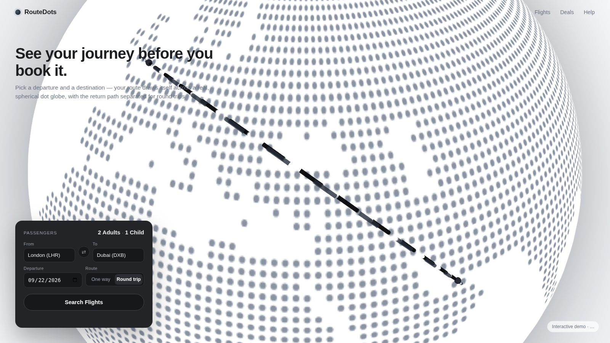
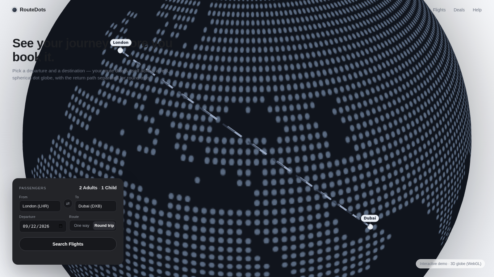
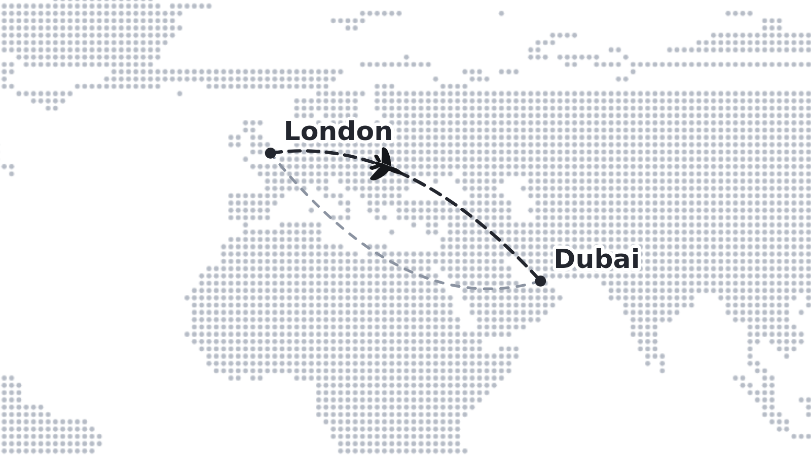

# RouteDots

**See the journey before the booking.** RouteDots renders your flight routes
on an interactive **dot globe** — the spherical, dot-map look airline heroes
are famous for — with curved great-circle arcs, a repeating plane animation,
and a flat 2D fallback for browsers without WebGL.



|                                            |                                                            |
| ------------------------------------------ | ---------------------------------------------------------- |
|  |  |

## Features

- 🌍 **A real sphere, not a flat map.** The globe is a 3D dot sphere; when the
  destination is off screen, the camera **pans across the surface** to frame
  the route.
- ➰ **Curved arcs.** Routes follow lifted great circles
  (`1 + lift·sin(πt)`), drawn on with a flowing-dash animation — never
  straight lines.
- ⇄ **Outbound and return never collide.** Round trips render two arcs with
  different lifts, so the "there and back" is readable at a glance.
- ✈️ **A plane that flies your route.** A small airliner repeats the outbound
  arc on an interval, oriented along the track.
- 📍 **City-name pins at each end.** Both endpoints carry a labelled pin badge
  that sticks to the globe as it rotates, and fades out on the far side.
- 🪶 **One dependency, offline data.** Built on `three.js`; the 110m world
  land mask (Natural Earth, public domain) is bundled — no tiles, no API keys.
- 🧯 **Graceful degradation.** Without WebGL you get the same dot map in 2D
  with curved SVG routes and an animated plane. Same API, no breakage.

## Quick start

```bash
npm install routedots three
```

```ts
import { RouteDots } from 'routedots';

const rd = new RouteDots(document.getElementById('hero-globe')!, {
  theme: 'light',
  autoRotate: { enabled: true, speed: 0.4 },
});

// Wire it to your flight form:
searchButton.addEventListener('click', () => {
  rd.setRoute(fromSelect.value, toSelect.value, { roundTrip: true });
});
```

No bundler? Use the IIFE build (three.js included):

```html
<script src="routedots.browser.global.js"></script>
<script>
  const rd = new RouteDots.RouteDots(document.getElementById('hero-globe'));
  rd.setRoute('THR', 'DXB', { roundTrip: true });
</script>
```

`setRoute` accepts IATA codes (31 cities bundled via `RouteDots.CITIES`,
case-insensitive), `City` objects, or bare `{ lat, lng }` points.

**Try it:** `npm run build && npm run dev`, then open
[`http://localhost:5173`](http://localhost:5173) — a full airline hero where
the search form (source/destination, swap, date, one-way/round trip,
light/dark theme) drives the globe live. The same page also works from any
static server once built: [`examples/showcase/index.html`](./examples/showcase/index.html).

## API in 30 seconds

|                                        |                                                                                                                                                                                 |
| -------------------------------------- | ------------------------------------------------------------------------------------------------------------------------------------------------------------------------------- |
| `new RouteDots(container, options?)`   | Mounts the globe (or flat fallback). Options: `theme`, `view`, `autoRotate`, `interactive`, `texture`, `route` (lifts, draw timing), `plane`, `frameRoute`, `fallback`, `land`… |
| `rd.setRoute(from, to, { roundTrip })` | Draws the route + pans the camera to frame it. Returns `false` for invalid pairs.                                                                                               |
| `rd.getRoute()` / `rd.clearRoute()`    | Inspect / remove the current route.                                                                                                                                             |
| `rd.setTheme('light' \| 'dark')`       | Live theme switch.                                                                                                                                                              |
| `rd.on('route:drawn', cb)`             | Events: `ready`, `route:updated`, `route:drawn`, `route:invalid`, `route:cleared`, `mode:changed`.                                                                              |
| `rd.dispose()`                         | Tear down.                                                                                                                                                                      |

Full reference: [docs/developer-guide.md](./docs/developer-guide.md).

## Development

```bash
git clone https://github.com/Airya-Xratu/RouteDots.git && cd RouteDots
npm install

npm run build       # ESM + CJS + dts + IIFE (three.js inlined)
npm run dev         # build, then serve the showcase at http://localhost:5173
npm test            # Vitest unit tests (pure core, rig, schedulers, model)
npm run test:e2e    # Playwright: WebGL rendering, routes, plane, showcase
npm run lint        # ESLint (flat)
npm run typecheck   # tsc --noEmit (strict)
npm run format:check
```

- **Docs:** [developer guide](./docs/developer-guide.md) · [architecture](./docs/architecture.md) · [contributing](./docs/contributing.md) · [changelog](./CHANGELOG.md)
- **Roadmap:** [ROADMAP.md](./ROADMAP.md)
- **Data credit:** world land mask from [world-atlas](https://github.com/topojson/world-atlas)
  (Natural Earth, public domain; world-atlas MIT), regenerated by
  `node tools/generate-land.mjs`.

## License

[MIT](./LICENSE)
